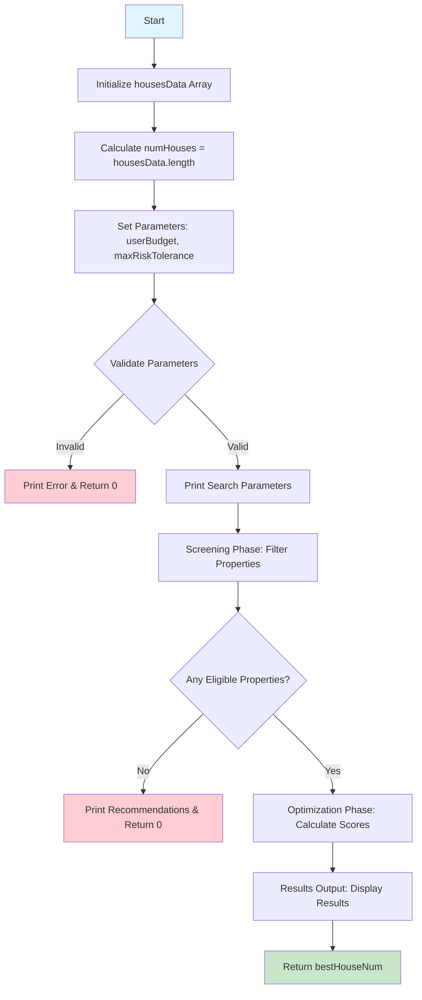
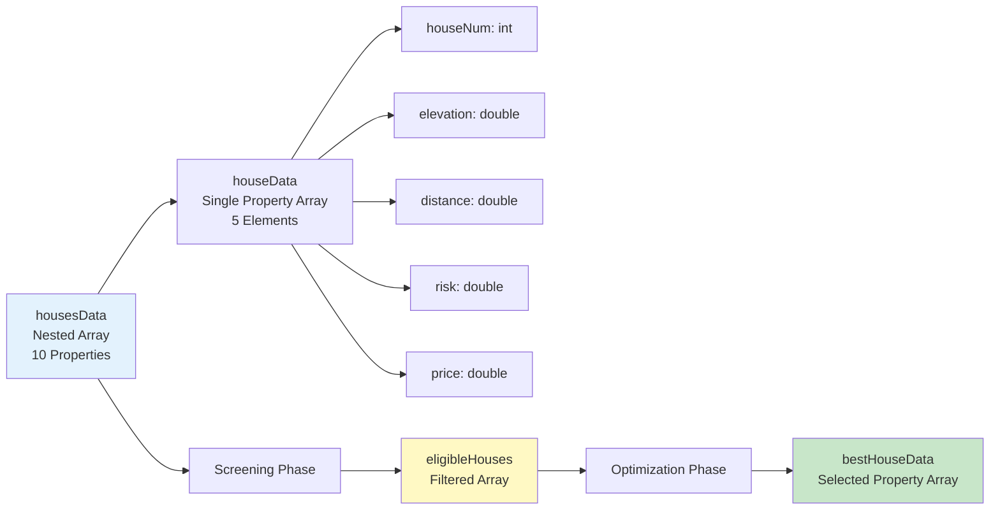

# Flood Risk Property Evaluation Engine - Architecture Documentation

## Overview

The Flood Risk Property Evaluation Engine is a FlexScript 21.1 application that evaluates residential properties based on flood risk criteria, budget constraints, and safety optimization metrics. The system implements a two-phase evaluation process: constraint-based screening followed by safety score optimization.

## System Architecture

### Program Structure

The application follows a linear, sequential architecture with five distinct phases:

1. **Data Initialization** - Embedded array data structure
2. **Parameter Validation** - Input validation and error handling
3. **Screening Phase** - Hard constraint filtering
4. **Optimization Phase** - Safety score calculation and ranking
5. **Results Output** - Formatted results presentation

### Overall System Flow



## Data Structures

### Primary Data Structure: Array

**`housesData`** - Nested Array containing property data
- **Type**: `Array` (nested)
- **Structure**: `[houseNum, elevation, distance, risk, price]`
- **Indexing**: 1-based (FlexScript standard)
- **Data Format**:
  - `houseNum` (int): Property identifier (1-10)
  - `elevation` (double): Elevation above river in meters
  - `distance` (double): Distance from river in meters
  - `risk` (double): Flood risk estimate (0.0-1.0)
  - `price` (double): Property price in USD

**Example**:
```flexscript
Array housesData = [
    [1, 28, 450, 0.15, 285000],
    [2, 12, 180, 0.68, 195000],
    ...
];
```

### Data Structure Relationships



### Working Data Structures

**`eligibleHouses`** - Array of properties passing screening
- **Type**: `Array`
- **Content**: Filtered subset of `housesData`
- **Usage**: Input for optimization phase

**`bestHouseData`** - Selected optimal property
- **Type**: `Array`
- **Content**: Single property array matching `housesData` structure
- **Usage**: Final recommendation output

## Core Functions and Commands

### FlexScript 21.1 Commands Used

| Command | Purpose | Usage |
|---------|---------|-------|
| `print()` | Console output | All user-facing messages |
| `string.fromNum()` | Number formatting | Decimal precision control (0-4 places) |
| `Array.length` | Array size | Property count validation |
| `Array.push()` | Array population | Building eligible properties list |
| `min()` | Minimum value | Range calculation for normalization |
| `max()` | Maximum value | Range calculation for normalization |
| Ternary operator `? :` | Conditional assignment | Normalization edge case handling |

## Module Breakdown

### 1. Data Initialization Module

**Purpose**: Initialize property dataset

**Implementation**:
- Static array initialization with 10 properties
- Direct data embedding (no external file dependencies)
- Array length calculation: `numHouses = housesData.length`

**Data Access Pattern**:
```flexscript
Array houseData = housesData[i];
int houseNum = houseData[1];
double elevation = houseData[2];
double distance = houseData[3];
double risk = houseData[4];
double price = houseData[5];
```

### 2. Parameter Validation Module

**Purpose**: Validate input parameters and data availability

**Validation Rules**:
1. `userBudget > 0` - Budget must be positive
2. `0 ≤ maxRiskTolerance ≤ 1` - Risk tolerance must be in valid range
3. `numHouses > 0` - Data must be available

**Error Handling**:
- Early return with error message on validation failure
- Uses `print()` for error output
- Returns `0` to indicate failure

**Parameters**:
- `userBudget` (double): Maximum purchase budget (default: 300000)
- `maxRiskTolerance` (double): Maximum acceptable risk (default: 0.40)

### 3. Screening Phase Module

**Purpose**: Filter properties based on hard constraints

**Screening Decision Logic Flowchart**:

```mermaid
flowchart TD
    A[Start Screening] --> B[Initialize eligibleHouses = []<br/>rejectedCount = 0]
    B --> C[FOR i = 1 to numHouses]
    C --> D[Extract Property Attributes<br/>houseNum, elevation, distance, risk, price]
    D --> E[Print Property Info]
    E --> F{price > userBudget?}
    F -->|Yes| G[Set rejectionReason =<br/>'Price exceeds budget']
    F -->|No| H{risk > maxRiskTolerance?}
    H -->|Yes| I[Set rejectionReason =<br/>'Risk level too high']
    H -->|No| J[Property ELIGIBLE]
    G --> K[rejectedCount++]
    I --> K
    K --> L[Print REJECTED Message]
    J --> M[eligibleHouses.push<br/>property data]
    M --> N[Print ELIGIBLE Message]
    L --> O{More Properties?}
    N --> O
    O -->|Yes| C
    O -->|No| P{eligibleHouses.length == 0?}
    P -->|Yes| Q[Print Recommendations<br/>Return 0]
    P -->|No| R[Continue to Optimization]
    
    style J fill:#c8e6c9
    style G fill:#ffcdd2
    style I fill:#ffcdd2
    style Q fill:#ffcdd2
```

**Decision Logic**:
- **Constraint 1**: `price ≤ userBudget`
- **Constraint 2**: `risk ≤ maxRiskTolerance`
- **Both constraints must be satisfied** for eligibility

**Output**:
- `eligibleHouses` array populated with qualifying properties
- `rejectedCount` tracking rejected properties
- Console output for each property evaluation

**Early Termination**:
- If `eligibleHouses.length == 0`: Print recommendations and exit

### 4. Optimization Phase Module

**Purpose**: Calculate safety scores and select optimal property

#### 4.1 Range Calculation

**Purpose**: Determine min/max values for normalization

**Range Calculation Flowchart**:

```mermaid
flowchart TD
    A[Start Range Calculation] --> B[Initialize:<br/>minElev = 1e9<br/>maxElev = -1e9<br/>minDist = 1e9<br/>maxDist = -1e9]
    B --> C[FOR i = 1 to eligibleHouses.length]
    C --> D[Extract elevation & distance<br/>from eligibleHouses[i]]
    D --> E[minElev = min(minElev, elev)]
    E --> F[maxElev = max(maxElev, elev)]
    F --> G[minDist = min(minDist, dist)]
    G --> H[maxDist = max(maxDist, dist)]
    H --> I{More Properties?}
    I -->|Yes| C
    I -->|No| J[Range Values Calculated]
    J --> K[Continue to Scoring]
    
    style J fill:#c8e6c9
```

**Algorithm**:
```flexscript
FOR each eligible property:
    minElev = min(minElev, elevation)
    maxElev = max(maxElev, elevation)
    minDist = min(minDist, distance)
    maxDist = max(maxDist, distance)
```

**Initialization**:
- `minElev = 1e9`, `maxElev = -1e9`
- `minDist = 1e9`, `maxDist = -1e9`

#### 4.2 Safety Score Calculation

**Purpose**: Normalize and combine safety metrics

**Safety Score Calculation Flowchart**:

```mermaid
flowchart TD
    A[Start Scoring] --> B[Initialize:<br/>bestScore = -1<br/>bestHouseNum = -1<br/>bestHouseData = []]
    B --> C[FOR i = 1 to eligibleHouses.length]
    C --> D[Extract Property Data:<br/>houseNum, elevation, distance, risk, price]
    D --> E{maxElev > minElev?}
    E -->|Yes| F[elevNorm =<br/>elevation - minElev /<br/>maxElev - minElev]
    E -->|No| G[elevNorm = 1.0]
    F --> H{maxDist > minDist?}
    G --> H
    H -->|Yes| I[distNorm =<br/>distance - minDist /<br/>maxDist - minDist]
    H -->|No| J[distNorm = 1.0]
    I --> K[safetyScore =<br/>0.5 * elevNorm +<br/>0.5 * distNorm]
    J --> K
    K --> L[Print Score Details]
    L --> M{safetyScore > bestScore?}
    M -->|Yes| N[Update Best:<br/>bestScore = safetyScore<br/>bestHouseNum = houseNum<br/>bestHouseData = houseData]
    M -->|No| O[Keep Current Best]
    N --> P{More Properties?}
    O --> P
    P -->|Yes| C
    P -->|No| Q[Best Property Selected]
    Q --> R[Continue to Results]
    
    style Q fill:#c8e6c9
    style N fill:#fff9c4
```

**Normalization Formula**:
```flexscript
elevNorm = (maxElev > minElev) ? (elevation - minElev) / (maxElev - minElev) : 1.0
distNorm = (maxDist > minDist) ? (distance - minDist) / (maxDist - minDist) : 1.0
```

**Edge Case Handling**:
- If `maxElev == minElev`: `elevNorm = 1.0` (single property case)
- If `maxDist == minDist`: `distNorm = 1.0` (single property case)

**Combined Safety Score**:
```flexscript
safetyScore = 0.5 * elevNorm + 0.5 * distNorm
```

**Weighting**:
- Elevation: 50% weight
- Distance: 50% weight
- Equal weighting for both safety factors

#### 4.3 Selection Algorithm

**Purpose**: Identify property with highest safety score

**Algorithm**:
```flexscript
bestScore = -1
FOR each eligible property:
    Calculate safetyScore
    IF safetyScore > bestScore:
        bestScore = safetyScore
        bestHouseNum = houseNum
        bestHouseData = houseData
```

**Selection Criteria**: Maximum safety score (higher is better)

### 5. Results Output Module

**Purpose**: Format and display evaluation results

**Results Output Flowchart**:

```mermaid
flowchart TD
    A[Start Results Output] --> B[Print Summary Statistics:<br/>Total Evaluated<br/>Eligible Count<br/>Rejected Count]
    B --> C[Print Recommended Property:<br/>Property Number<br/>Optimal Safety Score]
    C --> D[Print Property Details:<br/>Purchase Price<br/>Elevation<br/>Distance<br/>Flood Risk]
    D --> E{bestHouseData[4] < 0.30?}
    E -->|Yes| F[Category: LOW RISK<br/>Description: Minimal exposure]
    E -->|No| G{bestHouseData[4] < 0.60?}
    G -->|Yes| H[Category: MODERATE RISK<br/>Description: Consider insurance]
    G -->|No| I[Category: HIGH RISK<br/>Description: Protection needed]
    F --> J[Print Risk Assessment]
    H --> J
    I --> J
    J --> K[Print ANALYSIS COMPLETE]
    K --> L[Return bestHouseNum]
    
    style F fill:#c8e6c9
    style H fill:#fff9c4
    style I fill:#ffcdd2
    style L fill:#e1f5ff
```

#### 5.1 Summary Statistics

**Output**:
- Total properties evaluated
- Eligible properties count
- Rejected properties count
- Recommended property number
- Optimal safety score

#### 5.2 Property Details

**Output Format**:
- Purchase Price (0 decimal places)
- Elevation Above River (1 decimal place)
- Distance from River (0 decimal places)
- Flood Risk Estimate (2 decimal places)

#### 5.3 Risk Assessment

**Categorization Logic**:
```flexscript
IF risk < 0.30:
    Category: "LOW RISK"
    Description: "Minimal flood exposure"
ELSE IF risk < 0.60:
    Category: "MODERATE RISK"
    Description: "Consider additional flood insurance"
ELSE:
    Category: "HIGH RISK"
    Description: "Significant flood protection measures recommended"
```

**Thresholds**:
- Low Risk: `risk < 0.30`
- Moderate Risk: `0.30 ≤ risk < 0.60`
- High Risk: `risk ≥ 0.60`

## Data Flow

### Input Flow
```
Static Array (housesData) → Parameter Validation → Screening Filter → Optimization
```

### Processing Flow
```
housesData → Extract Attributes → Apply Constraints → Calculate Scores → Select Best
```

### Output Flow
```
Selected Property → Format Results → Console Output → Return Property Number
```

### Complete Data Flow Diagram

```mermaid
flowchart LR
    A[housesData<br/>10 Properties] --> B[Parameter<br/>Validation]
    B --> C[Screening<br/>Phase]
    C --> D[eligibleHouses<br/>Filtered Array]
    D --> E[Range<br/>Calculation]
    E --> F[minElev, maxElev<br/>minDist, maxDist]
    F --> G[Normalization<br/>& Scoring]
    G --> H[safetyScore<br/>for each property]
    H --> I[Selection:<br/>Max Score]
    I --> J[bestHouseData<br/>Selected Property]
    J --> K[Results<br/>Output]
    K --> L[Return<br/>bestHouseNum]
    
    style A fill:#e3f2fd
    style D fill:#fff9c4
    style J fill:#c8e6c9
    style L fill:#e1f5ff
```



## Key Algorithms

### Screening Algorithm
- **Type**: Constraint satisfaction
- **Complexity**: O(n) where n = number of properties
- **Method**: Sequential filtering with hard constraints

### Optimization Algorithm
- **Type**: Normalized scoring with weighted combination
- **Complexity**: O(n) for range calculation + O(n) for scoring = O(n)
- **Method**: Min-max normalization followed by weighted average

### Selection Algorithm
- **Type**: Maximum value selection
- **Complexity**: O(n) where n = eligible properties
- **Method**: Linear search with score comparison

## Error Handling

### Validation Errors
- **Budget validation**: Returns 0, prints error message
- **Risk tolerance validation**: Returns 0, prints error message
- **Data availability**: Returns 0, prints error message

### Edge Cases
- **No eligible properties**: Prints recommendations, returns 0
- **Single eligible property**: Normalization defaults to 1.0
- **Equal min/max values**: Ternary operator handles division by zero

## Output Formatting

### Number Formatting
- **Prices**: `string.fromNum(value, 0)` - No decimals
- **Risk values**: `string.fromNum(value, 2)` - Two decimals
- **Scores**: `string.fromNum(value, 4)` - Four decimals
- **Elevation**: `string.fromNum(value, 1)` - One decimal

### String Formatting
- Console output via `print()` function
- String concatenation using `+` operator
- Formatted labels and separators

## Return Value

**Function Return**: `int bestHouseNum`
- Returns property number of selected property
- Returns `0` on error or no eligible properties
- Used for programmatic integration

## Technical Specifications

### Language Version
- **FlexScript 21.1** - Full compliance verified

### Data Types
- `int`: Property numbers, counts
- `double`: Prices, elevations, distances, risks, scores
- `string`: Error messages, formatted output
- `Array`: Data storage and processing

### Performance Characteristics
- **Time Complexity**: O(n) linear time
- **Space Complexity**: O(n) for eligible properties array
- **Scalability**: Handles any number of properties in array

## Dependencies

### Built-in Functions
- `print()` - Standard output
- `string.fromNum()` - Number formatting
- `min()` / `max()` - Value comparison
- Array methods: `.length`, `.push()`

### External Dependencies
- **None** - Fully self-contained
- No file I/O operations
- No database connections
- No external libraries

## Implementation Notes

### Design Decisions
1. **Embedded Data**: Data stored directly in code for portability
2. **Sequential Processing**: Linear flow for clarity and maintainability
3. **Early Returns**: Error handling via early exit pattern
4. **Normalized Scoring**: Ensures fair comparison across different scales

### Limitations
- Fixed dataset size (10 properties)
- Static parameters (budget, risk tolerance)
- Single optimization objective (safety score)
- No user input mechanism

### Extension Points
- External data source integration
- Dynamic parameter input
- Multiple optimization objectives
- Configurable weighting factors

