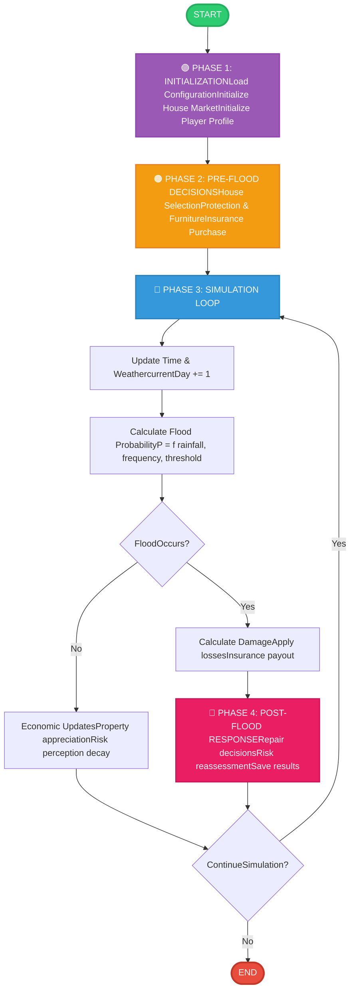

# Flood Risk Simulation Game - Program Architecture Documentation

**Target Platform:** FlexSim Simulation Environment  
**Document Type:** System Architecture & Design Specification

---

## Table of Contents

1. [Executive Summary](#1-executive-summary)
2. [System Architecture Overview](#2-system-architecture-overview)
3. [Module Architecture](#3-module-architecture)
4. [Data Structures & Models](#4-data-structures--models)
5. [Core Functions Specification](#5-core-functions-specification)
6. [Data Flow Architecture](#6-data-flow-architecture)
7. [FlexSim Implementation Strategy](#7-flexsim-implementation-strategy)
8. [Control Panel Parameters](#8-control-panel-parameters)

---

## 1. Executive Summary

### 1.1 Purpose
This document describes the complete program architecture for a flood risk simulation game designed to study decision-making processes under flood risk conditions. The simulation reproduces participant decisions before and after flood events, incorporating economic, psychological, and perceptual factors.

### 1.2 Scope
The architecture covers:
- Property purchase decision-making algorithms
- Flood event simulation and probability calculation
- Economic impact modeling (property values, insurance, damages)
- Psychological state tracking (risk perception, stress, confidence)
- Post-flood response and recovery mechanisms
- Data persistence and performance analytics

### 1.3 Key Design Principles
- **Modularity**: Clear separation of concerns across independent modules
- **Scalability**: Support for multiple players and configurable scenarios
- **Realism**: Evidence-based behavioral and economic models
- **Maintainability**: Clean code structure with well-defined interfaces
- **FlexSim Integration**: Optimal use of FlexSim's built-in features and FlexScript methods

---

## 2. System Architecture Overview

### 2.1 High-Level Architecture

The system follows a **four-phase pipeline architecture** with a central game controller orchestrating module interactions:

**Phase Flow:**
```
Initialization → Pre-Flood Decisions → Simulation Loop → Post-Flood Response
```

### 2.2 Architecture Diagrams

#### 2.2.1 Basic System Overview


The basic architecture shows the four main phases separated by color-coded boxes:
- **Purple (Phase 1)**: System initialization and configuration loading
- **Orange (Phase 2)**: Pre-flood decision-making (house selection, protection, insurance)
- **Blue (Phase 3)**: Continuous simulation loop with flood probability calculation
- **Pink (Phase 4)**: Post-flood response and results persistence

This high-level view emphasizes the cyclical nature of the simulation loop and the critical decision points that affect player outcomes.

#### 2.2.2 Detailed System Architecture

```mermaid
flowchart TD
    Start([START]) --> Init[PHASE 1: INITIALIZATION]
    
    Init --> LoadConfig[Load System Configuration- Rainfall intensity- Flood frequency- Insurance availability- Risk knowledge level]
    LoadConfig --> InitMarket[Initialize House MarketGenerate property database]
    InitMarket --> InitPlayer[Initialize Player Profile- Budget- Risk tolerance- Knowledge level- Psychology state]
    InitPlayer --> LoadData[(Load Property Databasehouse attributes)]
    
    LoadData --> Phase2[PHASE 2: PRE-FLOOD DECISIONS]
    
    Phase2 --> HouseSelect[House Selection Algorithm ModuleselectBestHouse]
    HouseSelect --> FilterBudget{Filter by Budgetprice ≤ playerBudget?}
    FilterBudget -->|No matches| ErrorMsg[Display Error MessageNo suitable house foundSuggest adjusting criteria]
    ErrorMsg --> AdjustCriteria[Player AdjustsBudget/Risk Tolerance]
    AdjustCriteria --> HouseSelect
    
    FilterBudget -->|Yes| FilterRisk{Filter by RiskriskLevel ≤ maxRisk?}
    FilterRisk -->|No matches| ErrorMsg
    FilterRisk -->|Yes| OptimizeLocation[Optimize by LocationMaximize: elevation + distanceScore = w1×elevation + w2×distance]
    
    OptimizeLocation --> HouseFound{Best HouseFound?}
    HouseFound -->|Yes| PurchaseHouse[Purchase Selected HouseDeduct cost from budgetUpdate player inventory]
    HouseFound -->|No| ErrorMsg
    
    PurchaseHouse --> UpdateOwnership[Update Property OwnershipRecord transaction]
    UpdateOwnership --> SetRiskParams[Set Player Risk Parameters- Max acceptable risk- Risk perception index]
    
    SetRiskParams --> ProtectionDecision{Purchase Furniture& Protection?}
    ProtectionDecision -->|Yes| BuyProtection[Purchase Furniture & Equipment- Deduct cost from budget- Set protection level- Reduce effective risk]
    ProtectionDecision -->|No| NoProtection[No Protection AppliedeffectiveRisk = baseRisk]
    
    BuyProtection --> CalcEffectiveRisk[Calculate Effective RiskeffectiveRisk = baseRisk × protectionFactor]
    NoProtection --> CalcEffectiveRisk
    CalcEffectiveRisk --> InsuranceDecision{Purchase Insurance?}
    
    InsuranceDecision -->|Yes| BuyInsurance[Buy Insurance Policy- Pay premium- Set coverage amount- insuranceActive = true]
    InsuranceDecision -->|No| NoInsurance[No InsuranceinsuranceActive = false]
    
    BuyInsurance --> Phase3[PHASE 3: SIMULATION LOOP]
    NoInsurance --> Phase3
    
    Phase3 --> SimLoop[Update Simulation TimecurrentDay += 1Update weather conditions]
    
    SimLoop --> CalcWeather[Calculate Weather Parameters- Current rainfall- River water level- Soil saturation]
    
    CalcWeather --> CalcFloodProb[Calculate Flood ProbabilityP = f rainfall, frequency, thresholdConsider seasonal factors]
    
    CalcFloodProb --> FloodOccurs{Flood EventOccurs?random ≤ P}
    
    FloodOccurs -->|No| UpdateEconomy[Update Economic State- Property appreciation- Maintenance costs- Insurance premium]
    UpdateEconomy --> UpdatePsych[Update Player Psychology- Risk perception decay- Confidence adjustment]
    UpdatePsych --> CheckSimEnd{SimulationTime Complete?}
    
    FloodOccurs -->|Yes| FloodEvent[FLOOD EVENT TRIGGERED]
    FloodEvent --> CalcDamage[Calculate Flood Damagedamage = f elevation, distance, protectiondamageAmount = f propertyValue, floodSeverity]
    
    CalcDamage --> ApplyDamage[Apply Damage to Property- Reduce property value- Calculate repair costs- Update damage history]
    
    ApplyDamage --> HasInsurance{InsuranceActive?}
    HasInsurance -->|Yes| InsurancePayout[Apply Insurance Payoutpayout = min coverage, actualDamageplayerBudget += payout]
    HasInsurance -->|No| NoCompensation[No CompensationFull loss absorbed by player]
    
    InsurancePayout --> UpdatePsychFlood[Update Player Psychology- Increase risk perception- Update worry/stress levels- Adjust future risk tolerance]
    NoCompensation --> UpdatePsychFlood
    
    UpdatePsychFlood --> Phase4[PHASE 4: POST-FLOOD RESPONSE]
    
    Phase4 --> UpdateGameState[Update Game State- Record flood event- Update statistics- Recalculate risk levels]
    
    UpdateGameState --> RepairDecision{Player Decidesto Repair?}
    RepairDecision -->|Yes| RepairProperty[Repair Property- Deduct repair cost- Restore property value- Update protection level]
    RepairDecision -->|No| AcceptDamage[Accept Current StateProperty remains damaged]
    
    RepairProperty --> ReassessRisk[Reassess Risk PositionUpdate player risk profile]
    AcceptDamage --> ReassessRisk
    
    ReassessRisk --> CheckSimEnd
    
    CheckSimEnd -->|No| SimLoop
    CheckSimEnd -->|Yes| SaveResults[(Save Simulation Results- Player decisions history- Flood events log- Final budget/property- Performance metrics)]
    
    SaveResults --> GenerateReport[Generate Performance Report- Economic outcomes- Risk management effectiveness- Decision quality analysis]
    
    GenerateReport --> End([END])
    
    style Start fill:#2ecc71,stroke:#27ae60,stroke-width:3px,color:#fff
    style End fill:#e74c3c,stroke:#c0392b,stroke-width:3px,color:#fff
    style Init fill:#9b59b6,stroke:#8e44ad,stroke-width:2px,color:#fff
    style Phase2 fill:#f39c12,stroke:#e67e22,stroke-width:2px,color:#fff
    style Phase3 fill:#3498db,stroke:#2980b9,stroke-width:2px,color:#fff
    style Phase4 fill:#e91e63,stroke:#c2185b,stroke-width:2px,color:#fff
    style FloodEvent fill:#e74c3c,stroke:#c0392b,stroke-width:3px,color:#fff
    style ErrorMsg fill:#e74c3c,stroke:#c0392b,stroke-width:2px,color:#fff
    style LoadData fill:#9b59b6,stroke:#8e44ad,stroke-width:2px,color:#fff
    style SaveResults fill:#9b59b6,stroke:#8e44ad,stroke-width:2px,color:#fff
```


The detailed architecture expands each phase to show:

**Phase 1 - Initialization:**
- Configuration loading (rainfall intensity, flood frequency, insurance availability, risk knowledge)
- House market generation from property database
- Player profile initialization (budget, risk tolerance, knowledge level, psychology state)
- Database connection and data structure setup

**Phase 2 - Pre-Flood Decisions:**
- **House Selection Algorithm Module** with multi-stage filtering:
  - Budget constraint filter (`price ≤ playerBudget`)
  - Risk tolerance filter (`riskLevel ≤ maxRisk`)
  - Location optimization (`maximize: w₁×elevation + w₂×distance`)
  - Error handling with adjustment loop
- Economic transactions (purchase cost deduction, inventory update)
- Protection decision module (furniture, equipment, flood barriers)
- Insurance decision module (premium calculation, coverage setup)
- Risk parameter configuration

**Phase 3 - Simulation Loop:**
- Time progression (`currentDay += 1`)
- Weather parameter updates (rainfall, river level, soil saturation)
- Flood probability calculation: `P = f(rainfall, frequency, threshold, seasonality)`
- Conditional flood event triggering
- **If flood occurs:**
  - Damage calculation based on elevation, distance, and protection level
  - Property value adjustment
  - Insurance payout processing (if applicable)
  - Psychological impact on player (risk perception increase, stress)
- **If no flood:**
  - Economic state updates (property appreciation, maintenance costs)
  - Psychological state updates (risk perception decay, confidence adjustment)
- Loop continuation check

**Phase 4 - Post-Flood Response:**
- Game state update and statistics recording
- Repair decision interface
- Property restoration or damage acceptance
- Risk position reassessment
- Results persistence to database
- Performance report generation

### 2.3 System Components

The system is decomposed into six primary modules:

1. **GameController Module** - Central orchestration and phase management
2. **HouseSelection Module** - Property search and optimization algorithms
3. **FloodSimulation Module** - Weather modeling and flood event generation
4. **Economic Module** - Financial calculations and transaction processing
5. **PlayerBehavior Module** - Psychological modeling and decision support
6. **DataStorage Module** - Persistence layer and analytics

---

## 3. Module Architecture

### 3.1 GameController Module

**Responsibility:** Central coordinator that manages game flow, phase transitions, and inter-module communication.

**Key Functions:**
- `initializeGame()` - Loads configuration and initializes all modules
- `runGameLoop()` - Main simulation loop controller
- `transitionPhase(currentPhase, nextPhase)` - Manages phase transitions
- `handleGameEvent(event)` - Event dispatcher for system-wide events
- `terminateGame()` - Cleanup and final result aggregation

**Interfaces:**
- **Input:** User configuration, player inputs, module callbacks
- **Output:** Phase transition signals, event broadcasts, system state updates

**Dependencies:**
- Calls all other modules
- Manages global game state
- Controls simulation clock

**FlexSim Implementation:**
- Use FlexSim `Model()` object as central controller
- Leverage `OnRunStart` trigger for initialization
- Use `OnRunEnd` trigger for result saving
- Implement as custom FlexScript class

---

### 3.2 HouseSelection Module

**Responsibility:** Implements the property selection algorithm based on user constraints and optimization criteria.

**Key Functions:**

#### `selectBestHouse(userBudget, maxRiskLevel, weights)`
**Purpose:** Find optimal property matching user criteria

**Algorithm:**
```
1. Load property database from DataStorage
2. Filter by budget: houses.filter(h => h.price ≤ userBudget)
3. Filter by risk: houses.filter(h => h.riskLevel ≤ maxRiskLevel)
4. If filtered list is empty:
   - Display error message
   - Request criteria adjustment
   - Return null
5. Calculate optimization score for each remaining house:
   score = w₁ × elevation + w₂ × distance
6. Sort by score (descending)
7. Return house with highest score
```

**Parameters:**
- `userBudget` (double): Maximum affordable price
- `maxRiskLevel` (double): Risk tolerance threshold [0-1]
- `weights` (array): Optimization weights [w₁, w₂]

**Returns:**
- `House` object: Selected property with all attributes
- `null`: If no suitable house found

**Error Handling:**
- Empty result set → trigger user feedback loop
- Invalid parameters → throw validation exception
- Database access failure → retry with exponential backoff

#### `calculateLocationScore(elevation, distance, weights)`
**Purpose:** Compute weighted optimization score

**Formula:**
```
score = weights[0] × normalize(elevation) + weights[1] × normalize(distance)
```

**Normalization:** Min-max scaling to [0,1] range

**Interfaces:**
- **Input:** User budget, risk tolerance, optimization preferences
- **Output:** Selected house object or error state
- **Dependencies:** DataStorage Module (property database access)

**FlexSim Implementation:**
- Use FlexSim `Table` object for property database
- Leverage `query()` method for filtering
- Implement sorting with FlexScript `Array.sort()`
- Use lambda functions for filter predicates

---

### 3.3 FloodSimulation Module

**Responsibility:** Models weather conditions, calculates flood probability, generates flood events, and computes damage.

**Key Functions:**

#### `updateWeatherConditions(currentDay, seasonality)`
**Purpose:** Simulate realistic weather progression

**Model:**
```
rainfall(t) = baseRainfall × seasonalFactor(t) × randomVariation
riverLevel(t) = riverLevel(t-1) + rainfall(t) × runoffCoefficient
soilSaturation(t) = f(rainfall history, drainage rate)
```

**Parameters:**
- `currentDay` (int): Current simulation day
- `seasonality` (array): Monthly rainfall patterns

**Returns:** `WeatherState` object with current conditions

#### `calculateFloodProbability(weather, configuration)`
**Purpose:** Compute flood likelihood based on current conditions

**Model:**
```
P(flood) = sigmoid(α₁×rainfall + α₂×riverLevel + α₃×saturation - threshold)

Where sigmoid(x) = 1 / (1 + e^(-x))
```

**Parameters:**
- `weather` (WeatherState): Current weather conditions
- `configuration` (Config): System parameters (frequency, threshold)

**Returns:**
- `probability` (double): Flood probability [0-1]

#### `triggerFloodEvent(probability)`
**Purpose:** Stochastic flood event generation

**Algorithm:**
```
random = uniform(0, 1)
if random ≤ probability:
    return true (flood occurs)
else:
    return false (no flood)
```

#### `calculateDamage(house, floodSeverity, protectionLevel)`
**Purpose:** Compute economic and structural damage

**Model:**
```
baseDamage = propertyValue × floodSeverity × exposureFactor(elevation, distance)

exposureFactor = exp(-β₁×elevation) × exp(-β₂×distance)

effectiveDamage = baseDamage × (1 - protectionLevel)

repairCost = effectiveDamage × repairCostRatio
```

**Parameters:**
- `house` (House): Property object with location attributes
- `floodSeverity` (double): Flood intensity [0-1]
- `protectionLevel` (double): Installed protection effectiveness [0-1]

**Returns:** `DamageReport` object containing:
- `structuralDamage` (double)
- `propertyValueLoss` (double)
- `repairCost` (double)
- `estimatedRecoveryTime` (int days)

**Interfaces:**
- **Input:** Configuration parameters, current game state, random seed
- **Output:** Weather state, flood probability, damage reports
- **Dependencies:** GameController (clock), Economic Module (property values)

**FlexSim Implementation:**
- Use FlexSim `duniform()`, `normal()` for stochastic processes
- Store weather history in FlexSim `Global Table`
- Implement as state machine with FlexSim `Process Flow`

---

### 3.4 Economic Module

**Responsibility:** Manages all financial transactions, property valuations, insurance calculations, and economic state updates.

**Key Functions:**

#### `processTransaction(player, transactionType, amount)`
**Purpose:** Handle monetary operations with validation

**Types:**
- `PURCHASE` - Property acquisition
- `PROTECTION` - Equipment/furniture purchase
- `INSURANCE_PREMIUM` - Insurance payment
- `INSURANCE_PAYOUT` - Claim settlement
- `REPAIR` - Property restoration
- `MAINTENANCE` - Recurring costs

**Validation:**
- Budget sufficiency check
- Transaction limit enforcement
- Double-spend prevention

**Parameters:**
- `player` (Player): Player object with budget
- `transactionType` (enum): Transaction category
- `amount` (double): Transaction value

**Returns:**
- `success` (boolean): Transaction result
- `newBalance` (double): Updated player budget

#### `updatePropertyValue(house, marketConditions, damageState)`
**Purpose:** Dynamic property valuation

**Model:**
```
currentValue = baseValue × appreciationFactor × (1 - damageRatio)

appreciationFactor = (1 + appreciationRate)^yearsElapsed

damageRatio = accumulatedDamage / replacementCost
```

**Parameters:**
- `house` (House): Property object
- `marketConditions` (MarketState): Appreciation rate, demand
- `damageState` (DamageHistory): Accumulated damage

**Returns:** `updatedValue` (double)

#### `calculateInsurancePremium(house, coverage, riskLevel)`
**Purpose:** Actuarial premium calculation

**Model:**
```
premium = coverage × riskLevel × premiumRate + fixedFee

premiumRate = baseRate × riskMultiplier(elevation, distance)
```

**Parameters:**
- `house` (House): Insured property
- `coverage` (double): Coverage amount
- `riskLevel` (double): Flood risk [0-1]

**Returns:** `annualPremium` (double)

#### `processInsuranceClaim(house, damageAmount, policy)`
**Purpose:** Calculate insurance payout

**Model:**
```
payout = min(coverage, actualDamage - deductible)

If actualDamage < deductible:
    payout = 0
```

**Parameters:**
- `house` (House): Damaged property
- `damageAmount` (double): Actual damage cost
- `policy` (InsurancePolicy): Coverage details

**Returns:** `payoutAmount` (double)

**Interfaces:**
- **Input:** Transaction requests, property data, insurance policies
- **Output:** Updated financial states, valuations, premium/payout calculations
- **Dependencies:** FloodSimulation (damage data), DataStorage (transaction log)

**FlexSim Implementation:**
- Use FlexSim `tracked variables` for budget tracking
- Store financial history in `Statistics Collector`
- Implement transactions as atomic operations
3.5 PlayerBehavior Module
Responsibility: Models psychological states, risk perception dynamics, and influences decision-making processes based on behavioral economics principles.
Key Functions:
updateRiskPerception(player, event, intensity)
Purpose: Adjust player's subjective flood risk assessment
Psychological Model:
After flood event:
    riskPerception(t) = min(1.0, riskPerception(t-1) + Δincrease × intensity)
    Δincrease = learningRate × (1 - currentPerception)

During calm periods (no flood):
    riskPerception(t) = riskPerception(t-1) × decayFactor
    decayFactor = exp(-λ × daysSinceLastFlood)
Parameters:

player (Player): Player object with psychology state
event (EventType): FLOOD_OCCURRED, NO_FLOOD, NEAR_MISS
intensity (double): Event severity [0-1]

Returns: updatedPerception (double [0-1])
calculateStressLevel(player, economicLoss, riskExposure)
Purpose: Compute psychological stress based on economic and risk factors
Model:
stress = α × normalizedLoss + β × riskExposure + γ × uncertainty

normalizedLoss = economicLoss / totalWealth

uncertainty = variance(recent flood events)
Parameters:

player (Player): Player with current stress state
economicLoss (double): Recent financial losses
riskExposure (double): Current property risk level

Returns: stressLevel (double [0-1])
adjustConfidence(player, outcomeType)
Purpose: Update player confidence in their decision-making
Model:
If positive outcome (avoided loss):
    confidence(t) = min(1.0, confidence(t-1) + reinforcementRate)

If negative outcome (suffered loss):
    confidence(t) = confidence(t-1) × (1 - penaltyRate)
Parameters:

player (Player): Player object
outcomeType (enum): POSITIVE, NEGATIVE, NEUTRAL

Returns: updatedConfidence (double [0-1])
influenceDecision(player, decisionType, options)
Purpose: Apply psychological biases to decision-making
Biases Implemented:

Availability bias: Recent floods increase protection spending
Optimism bias: Underestimation of personal risk
Loss aversion: Greater weight on potential losses
Recency effect: Recent events dominate perception

Parameters:

player (Player): Player with psychology profile
decisionType (enum): HOUSE_PURCHASE, INSURANCE, PROTECTION
options (array): Available choices

Returns: modifiedOptions (array with adjusted utilities)
Interfaces:

Input: Event history, economic outcomes, player decisions
Output: Updated psychological states, decision influence factors
Dependencies: GameController (event stream), Economic Module (loss data)

FlexSim Implementation:

Store psychology state in player tracked variables
Use FlexSim labels for dynamic state tracking
Implement bias calculations as FlexScript functions


3.6 DataStorage Module
Responsibility: Manages data persistence, retrieval, and analytics across simulation sessions.
Key Functions:
savePlayerDecision(player, decision, timestamp)
Purpose: Log all player choices for analysis
Data Structure:
DecisionRecord {
    playerId: string
    timestamp: datetime
    decisionType: enum
    chosenOption: object
    alternativeOptions: array
    psychologyState: object
    economicState: object
}
saveFloodEvent(event, affectedProperties)
Purpose: Record flood occurrences and impacts
Data Structure:
FloodEventRecord {
    eventId: string
    timestamp: datetime
    severity: double
    weatherConditions: object
    affectedHouses: array
    totalDamage: double
    insurancePayouts: double
}
saveSimulationResults(gameState, metrics)
Purpose: Persist final simulation outcomes
Data Structure:
SimulationResults {
    sessionId: string
    configurationParams: object
    playerFinalState: object
    performanceMetrics: {
        totalEconomicLoss: double
        floodEventsCount: int
        decisionsCorrect: int
        decisionsIncorrect: int
        finalBudget: double
        propertyValue: double
        riskManagementScore: double
    }
    decisionHistory: array
    eventHistory: array
}
generatePerformanceReport(sessionId)
Purpose: Create analytical summary of simulation session
Report Sections:

Economic performance analysis
Risk management effectiveness
Decision quality assessment
Psychological adaptation metrics
Comparative benchmarks

Parameters:

sessionId (string): Unique simulation identifier

Returns: PerformanceReport (structured document)
Interfaces:

Input: All module data streams
Output: Persisted records, analytical reports, historical data
Dependencies: All modules (data collection)

FlexSim Implementation:

Use FlexSim Global Tables for structured data
Export to Excel using Table.save()
Use FlexSim Statistics Collector for time-series data
Implement custom SQL queries if database connection available


4. Data Structures & Models
4.1 House Data Model
javascriptHouse {
    houseNumber: int              // Unique identifier
    elevation: double             // Meters above river level
    distanceFromRiver: double     // Meters from riverbank
    floodRiskEstimate: double     // Risk level [0-1, where 1 = highest]
    housePrice: double            // Purchase price (dollars)
    propertyValue: double         // Current market value
    baseValue: double             // Original value at creation
    protectionLevel: double       // Installed protection [0-1]
    damageHistory: array          // Past damage events
    owner: Player                 // Current owner (null if unsold)
    insurancePolicy: Insurance    // Associated policy (null if none)
}
Validation Rules:

elevation > 0
distanceFromRiver > 0
0 ≤ floodRiskEstimate ≤ 1
housePrice > 0
0 ≤ protectionLevel ≤ 1

4.2 Player Data Model
javascriptPlayer {
    playerId: string
    playerName: string
    currentBudget: double           // Available funds
    initialBudget: double           // Starting budget
    ownedProperties: array          // Houses owned
    riskTolerance: double           // Max acceptable risk [0-1]
    knowledgeLevel: double          // Flood risk awareness [0-1]
    
    psychologyState: {
        riskPerception: double      // Subjective risk assessment [0-1]
        stressLevel: double         // Current stress [0-1]
        confidence: double          // Decision confidence [0-1]
        worryLevel: double          // Anxiety about floods [0-1]
        optimismBias: double        // Tendency to underestimate risk [0-1]
    }
    
    decisionHistory: array          // Past decisions made
    economicHistory: array          // Financial transactions
}
4.3 GameState Data Model
javascriptGameState {
    sessionId: string
    currentDay: int                 // Simulation day counter
    currentPhase: enum              // INIT, PRE_FLOOD, SIMULATION, POST_FLOOD
    
    configuration: {
        rainfallIntensity: double   // Base rainfall rate
        floodFrequency: double      // Expected floods per year
        insuranceAvailable: boolean
        insurancePremiumRate: double
        marketAppreciationRate: double
        seasonalityPattern: array   // Monthly variation factors
    }
    
    weatherState: {
        currentRainfall: double
        riverWaterLevel: double
        soilSaturation: double
        temperatureC: double
        forecastDays: int
    }
    
    marketState: {
        averagePropertyValue: double
        appreciationRate: double
        availableHouses: array
        transactionVolume: int
    }
    
    floodHistory: array             // Past flood events
    activeInsurancePolicies: array
}
4.4 Insurance Policy Model
javascriptInsurancePolicy {
    policyId: string
    insuredHouse: House
    coverageAmount: double          // Max payout
    annualPremium: double           // Yearly cost
    deductible: double              // Out-of-pocket minimum
    policyStartDate: datetime
    claimsHistory: array
    isActive: boolean
}
4.5 Damage Report Model
javascriptDamageReport {
    reportId: string
    affectedHouse: House
    floodEvent: FloodEvent
    structuralDamage: double        // Physical damage cost
    propertyValueLoss: double       // Market value reduction
    repairCost: double              // Estimated repair cost
    estimatedRecoveryTime: int      // Days to full repair
    insuranceClaim: {
        eligible: boolean
        claimAmount: double
        payoutAmount: double
    }
}

5. Core Functions Specification
5.1 House Selection Algorithm
Function Signature:
javascriptHouse selectBestHouse(
    double userBudget,
    double maxRiskLevel,
    array weights = [0.5, 0.5]
)
Detailed Algorithm:
INPUT: userBudget, maxRiskLevel, weights[elevation_weight, distance_weight]

STEP 1: Data Retrieval
    houses = DataStorage.loadHouseDatabase()
    
STEP 2: Budget Filtering
    candidateHouses = []
    FOR EACH house IN houses:
        IF house.price ≤ userBudget:
            candidateHouses.append(house)
    
    IF candidateHouses.isEmpty():
        DISPLAY "No houses within budget"
        RETURN null

STEP 3: Risk Filtering
    safeHouses = []
    FOR EACH house IN candidateHouses:
        IF house.floodRiskEstimate ≤ maxRiskLevel:
            safeHouses.append(house)
    
    IF safeHouses.isEmpty():
        DISPLAY "No houses meet risk criteria"
        SUGGEST "Increase risk tolerance or budget"
        RETURN null

STEP 4: Score Calculation
    FOR EACH house IN safeHouses:
        // Normalize to [0,1] range
        normElevation = (house.elevation - minElevation) / 
                       (maxElevation - minElevation)
        normDistance = (house.distanceFromRiver - minDistance) / 
                      (maxDistance - minDistance)
        
        // Weighted sum
        house.optimizationScore = weights[0] × normElevation + 
                                 weights[1] × normDistance

STEP 5: Selection
    safeHouses.sortByDescending(optimizationScore)
    selectedHouse = safeHouses[0]  // Highest score
    
    RETURN selectedHouse
Time Complexity: O(n log n) due to sorting
Space Complexity: O(n) for filtered arrays
Error Cases:

Empty database → Throw DatabaseEmptyException
Invalid parameters → Throw InvalidParameterException
No matches → Return null with user feedback
Database access failure → Retry with exponential backoff


5.2 Flood Probability Calculation
Function Signature:
javascriptdouble calculateFloodProbability(
    WeatherState weather,
    Configuration config
)
Algorithm:
INPUT: weather {rainfall, riverLevel, saturation}, config {frequency, threshold}

STEP 1: Feature Extraction
    x1 = weather.rainfall / config.maxRainfall
    x2 = weather.riverLevel / config.criticalLevel
    x3 = weather.soilSaturation
    x4 = config.floodFrequency  // Base probability

STEP 2: Linear Combination
    z = α1×x1 + α2×x2 + α3×x3 + α4×x4 - threshold
    
    // Typical weights (calibrated from historical data):
    α1 = 0.35  // Rainfall importance
    α2 = 0.30  // River level importance
    α3 = 0.25  // Soil saturation importance
    α4 = 0.10  // Base frequency

STEP 3: Sigmoid Transformation
    probability = 1 / (1 + exp(-z))
    
    // This ensures output in [0, 1] range

STEP 4: Seasonal Adjustment
    seasonalFactor = config.seasonalityPattern[currentMonth]
    adjustedProbability = probability × seasonalFactor
    
    // Clamp to valid range
    finalProbability = max(0.0, min(1.0, adjustedProbability))

RETURN finalProbability
Calibration: Weights α₁, α₂, α₃, α₄ should be calibrated using historical flood data from the target region.

5.3 Damage Calculation
Function Signature:
javascriptDamageReport calculateDamage(
    House house,
    double floodSeverity,
    double protectionLevel
)
Algorithm:
INPUT: house, floodSeverity [0-1], protectionLevel [0-1]

STEP 1: Exposure Factor Calculation
    // Exponential decay with distance and elevation
    β1 = 0.05  // Elevation decay rate
    β2 = 0.002 // Distance decay rate
    
    exposureFactor = exp(-β1 × house.elevation) × 
                    exp(-β2 × house.distanceFromRiver)
    
    // This ranges from ~0.05 (far/high) to ~0.9 (close/low)

STEP 2: Base Damage Calculation
    baseDamage = house.propertyValue × floodSeverity × exposureFactor

STEP 3: Protection Adjustment
    // Protection reduces damage (0 = no protection, 1 = perfect)
    effectiveDamage = baseDamage × (1 - protectionLevel)

STEP 4: Derived Costs
    // Repair costs typically 80-120% of damage
    repairCostRatio = uniform(0.8, 1.2)
    repairCost = effectiveDamage × repairCostRatio
    
    // Property value loss (permanent)
    valueLossRatio = 0.3  // 30% of damage affects resale value
    propertyValueLoss = effectiveDamage × valueLossRatio
    
    // Recovery time estimation (days)
    baseRecoveryDays = 30
    recoveryTime = baseRecoveryDays × (effectiveDamage / house.propertyValue)

STEP 5: Report Generation
    report = new DamageReport()
    report.structuralDamage = effectiveDamage
    report.propertyValueLoss = propertyValueLoss
    report.repairCost = repairCost
    report.estimatedRecoveryTime = recoveryTime

RETURN report

6. Data Flow Architecture
6.1 Initialization Phase Data Flow
User Input → GameController
    ↓
GameController → Configuration Loading
    ↓
Configuration → All Modules (broadcast)
    ↓
DataStorage → House Database → HouseSelection Module
    ↓
DataStorage → Player Profile → PlayerBehavior Module
    ↓
GameController ← All Modules (initialization complete signals)
6.2 House Selection Data Flow
Player Input (budget, risk) → HouseSelection Module
    ↓
HouseSelection → DataStorage (query house database)
    ↓
DataStorage → HouseSelection (return filtered houses)
    ↓
HouseSelection → Optimization Algorithm (internal)
    ↓
HouseSelection → Economic Module (process transaction)
    ↓
Economic Module → Player Budget (deduct cost)
    ↓
DataStorage ← Transaction Log (persist)
    ↓
GameController ← Selected House (return)
6.3 Simulation Loop Data Flow
GameController → FloodSimulation (tick)
    ↓
FloodSimulation → Weather Update (internal)
    ↓
FloodSimulation → Flood Probability Calculation
    ↓
IF flood occurs:
    FloodSimulation → Damage Calculation
    ↓
    Damage Report → Economic Module (apply losses)
    ↓
    Economic Module → Property Value Update
    ↓
    Economic Module → Insurance Module (if applicable)
    ↓
    Insurance Module → Player Budget (payout)
    ↓
    Damage Report → PlayerBehavior (psychological impact)
    ↓
    PlayerBehavior → Risk Perception Update
    ↓
    DataStorage ← Event Logging
ELSE:
    Economic Module → Property Appreciation
    ↓
    PlayerBehavior → Risk Perception Decay
    
GameController ← Updated Game State (all modules)
6.4 Post-Flood Response Data Flow
GameController → Player Interface (repair decision prompt)
    ↓
Player Decision → Economic Module (budget check)
    ↓
IF repair chosen:
    Economic Module → Property Restoration
    ↓
    House.propertyValue ← Restored
ELSE:
    Property → Damaged State (persist)
    
PlayerBehavior → Risk Reassessment
    ↓
DataStorage ← Decision Logging
    ↓
GameController → Check Simulation End

7. FlexSim Implementation Strategy
7.1 FlexSim Environment Setup
Project Structure:
FloodRiskSimulation.fsm
├── Model Tree
│   ├── Tools/GlobalTables
│   │   ├── HouseDatabase
│   │   ├── PlayerProfiles
│   │   ├── ConfigurationParams
│   │   └── FloodHistory
│   ├── Tools/ProcessFlow
│   │   ├── GameLoopProcess
│   │   ├── DecisionFlowProcess
│   │   └── FloodEventProcess
│   └── Visual Components
│       ├── ControlPanel (GUI)
│       ├── DashboardDisplay
│       └── 3DVisualization (river, houses)
└── Code/GlobalFunctions
    ├── HouseSelectionModule.fs
    ├── FloodSimulationModule.fs
    ├── EconomicModule.fs
    └── PlayerBehaviorModule.fs
7.2 Module Implementation in FlexScript
GameController Implementation:
javascript// In Model OnRunStart trigger
Object gameController = Model();
gameController.setLabel("gameState", "INITIALIZATION");

// Initialize modules
initializeAllModules();

// Start main loop
gameController.setLabel("currentDay", 0);
runGameLoop();
HouseSelection Implementation:
javascript// Use FlexSim Table for database
Table houses = Table("HouseDatabase");

// selectBestHouse function
Object selectBestHouse(double budget, double maxRisk) {
    // Clone table for filtering
    Array filteredHouses = houses.clone();
    
    // Budget filter using FlexSim query
    filteredHouses = filteredHouses.query(
        "SELECT * WHERE COLUMN('house_price') <= " + string(budget)
    );
    
    // Risk filter
    filteredHouses = filteredHouses.query(
        "SELECT * WHERE COLUMN('flood_risk_estimate') <= " + string(maxRisk)
    );
    
    if (filteredHouses.length == 0)
        return null;
    
    // Score calculation
    for (int i = 1; i <= filteredHouses.rows; i++) {
        double elevation = filteredHouses[i][2];
        double distance = filteredHouses[i][3];
        double score = 0.5 * elevation + 0.5 * distance;
        filteredHouses[i].setLabel("score", score);
    }
    
    // Sort by score
    filteredHouses.sort(5, 0);  // Column 5 (score), descending
    
    return filteredHouses[1];  // Return best house
}
FloodSimulation Implementation:
javascript// Probability calculation
double calculateFloodProbability() {
    double rainfall = Model().getLabel("currentRainfall");
    double riverLevel = Model().getLabel("riverLevel");
    double saturation = Model().getLabel("soilSaturation");
    
    double z = 0.35*rainfall + 0.30*riverLevel + 0.25*saturation - 0.5;
    double prob = 1.0 / (1.0 + exp(-z));
    
    return prob;
}

// Flood event trigger
if (duniform(0,1) <= calculateFloodProbability()) {
    triggerFloodEvent();
}
7.3 Control Panel Configuration
GUI Dashboard Parameters:
Adjustable Sliders:
- Rainfall Intensity: [0-100] mm/day
- Flood Frequency: [0-1] events/year
- Insurance Premium Rate: [0-10]%
- Market Appreciation: [0-10]%
- Player Knowledge Level: [0-1]
- Initial Budget: [$50k-$500k]

Toggle Switches:
- Insurance Available: ON/OFF
- Seasonal Variation: ON/OFF
- Psychological Modeling: ON/OFF

Display Metrics:
- Current Day
- Flood Count
- Player Budget
- Property Values
- Risk Levels
Implementation:
javascript// Dashboard update function
void updateDashboard() {
    Object dashboard = node("/Tools/Dashboard", model());
    dashboard.labels["currentDay"] = Model().labels["currentDay"];
    dashboard.labels["playerBudget"] = player.labels["budget"];
    dashboard.labels["floodCount"] = globalFloodCounter;
    // ... update all metrics
}
7.4 Data Persistence Strategy
Using FlexSim Tables for Persistence:
javascript// Save simulation results
void saveResults() {
    Table results = Table("SimulationResults");
    int row = results.rows + 1;
    
    results[row][1] = Model().labels["sessionId"];
    results[row][2] = Model().labels["currentDay"];
    results[row][3] = player.labels["finalBudget"];
    results[row][4] = calculateRiskScore();
    
    // Export to Excel
    results.save("results_" + getmodelname() + ".csv");
}

8. Control Panel Parameters
8.1 System Configuration Parameters
ParameterTypeRangeDefaultDescriptionrainfallIntensitydouble0-10050Base rainfall rate (mm/day)floodFrequencydouble0-10.1Expected floods per yearfloodThresholddouble0-10.5Probability threshold for floodinsuranceAvailableboolean-trueWhether insurance can be purchasedinsurancePremiumRatedouble0-0.10.02Annual premium as % of coverageinsuranceDeductibledouble0-500005000Out-of-pocket minimum ($)marketAppreciationRatedouble0-0.10.03Annual property value increaseseasonalityEnabledboolean-trueApply seasonal rainfall patternsplayerInitialBudgetdouble50000-500000300000Starting player funds ($)playerKnowledgeLeveldouble0-10.5Flood risk awareness levelpsychologyModelingEnabledboolean-trueEnable behavior modelingsimulationDurationint1-36501825Simulation length (days = 5 years)
8.2 Advanced Parameters
ParameterTypeRangeDefaultDescriptionriskPerceptionDecayRatedouble0-0.10.01Daily decay of risk perceptionlearningRatedouble0-10.3Speed of risk perception update after floodoptimismBiasdouble0-10.2Player tendency to underestimate riskprotectionEffectivenessdouble0-10.6Damage reduction from protectionrepairCostVariancedouble0-0.50.2Uncertainty in repair cost estimates
8.3 Parameter Validation Rules
javascript// Validation function
boolean validateParameters(Configuration config) {
    if (config.rainfallIntensity < 0 || config.rainfallIntensity > 100)
        return false;
    if (config.floodFrequency < 0 || config.floodFrequency > 1)
        return false;
    if (config.playerInitialBudget < 50000)
        return false;
    // ... additional validations
    return true;
}

Conclusion
This architecture provides a comprehensive, modular framework for implementing the flood risk simulation game in FlexSim. The design emphasizes:

Modularity: Clear separation of concerns across six independent modules
Scalability: Easy addition of new features or parameters
Realism: Evidence-based models for flood risk, economics, and psychology
Maintainability: Clean interfaces and well-documented functions
FlexSim Optimization: Strategic use of FlexSim's native features and FlexScript

The next phase involves implementing the FlexScript code for the house selection algorithm based on this architectural foundation.